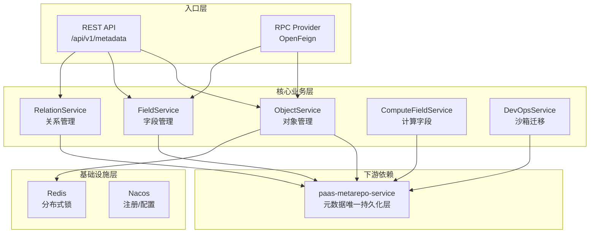
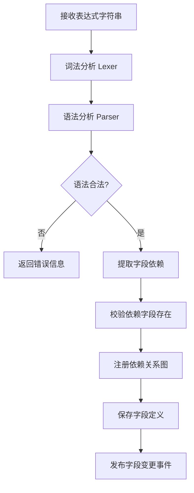
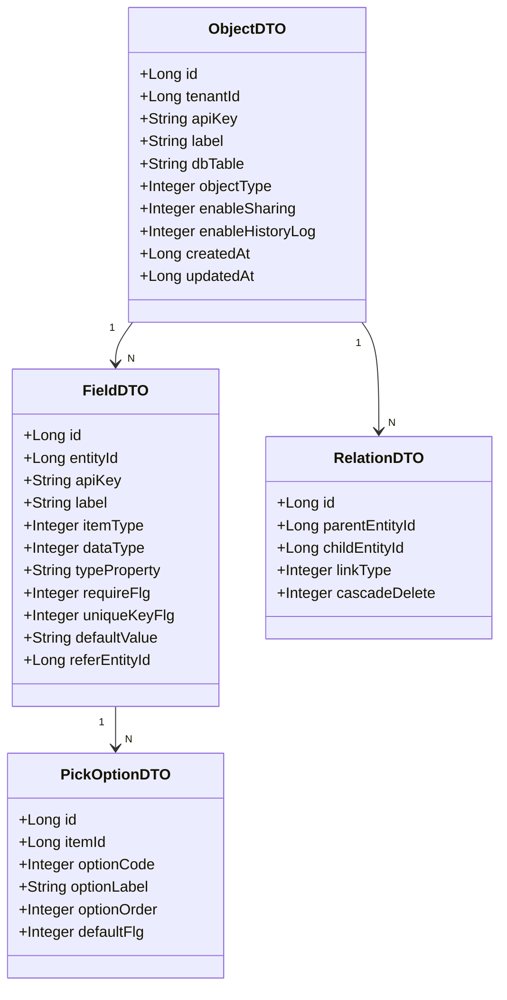
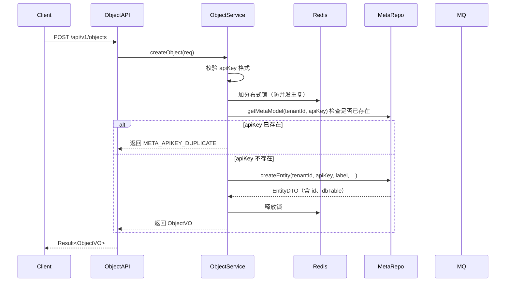
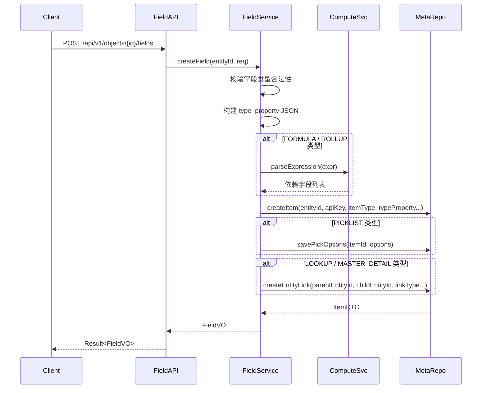

# paas-metadata-service 技术设计方案

## 1. 服务概述

元数据管理服务，负责 aPaaS 平台中所有业务对象（Object）、字段（Field）、关系（Relation）的定义与生命周期管理。是整个平台的"数据字典"，**自身不持有独立数据库**，所有持久化操作通过 RPC 调用 `paas-metarepo-service` 完成，metarepo 是唯一的元数据存储层。

**服务层级：L1（平台基础层，与 metarepo-service 同层）**

---

## 2. 系统架构



---

## 3. 模块职责

### 3.1 ObjectService（对象管理）

管理自定义对象的完整生命周期，所有持久化通过 MetaRepo RPC 完成。

| 方法 | 说明 |
|---|---|
| `createObject` | 校验 apiKey 唯一性，加分布式锁，调用 MetaRepo.createEntity |
| `updateObject` | 更新对象属性，调用 MetaRepo.updateEntity |
| `deleteObject` | 软删除，调用 MetaRepo.deleteEntity，级联处理字段和关系 |
| `queryObject` | 调用 MetaRepo.getMetaModel 查询对象定义 |
| `listObjects` | 调用 MetaRepo.listMetaModels 分页查询 |

**关键设计：**
- 对象 apiKey 全局唯一（租户维度），创建时用 Redis 分布式锁防并发重复
- 删除采用软删除，由 metarepo 设置 `delete_flg=1`
- 本服务不持有任何数据库连接，所有读写均通过 MetaRepo RPC

### 3.2 FieldService（字段管理）

管理对象下的字段定义，字段类型扩展属性存入 `p_custom_item.type_property`（JSON）。

| 字段类型 | 说明 |
|---|---|
| TEXT / TEXTAREA | 文本类型 |
| NUMBER / CURRENCY | 数值/货币 |
| DATE / DATETIME | 日期时间 |
| PICKLIST / MULTIPICKLIST | 选项值，选项存 p_custom_pickoption |
| LOOKUP / MASTER_DETAIL | 关联关系，关系存 p_custom_entity_link |
| FORMULA | 公式计算字段 |
| ROLLUP | 汇总字段 |

**关键设计：**
- 字段类型变更有严格的兼容性校验（如 TEXT→NUMBER 需数据迁移）
- FORMULA/ROLLUP 字段创建时解析表达式，注册依赖关系
- 字段删除前通过 MetaRepo 检查布局、规则等引用，有引用则拒绝删除
- PICKLIST 类型同步调用 MetaRepo.savePickOptions 写入选项值
- LOOKUP 类型同步调用 MetaRepo.createEntityLink 写入关联关系

### 3.3 RelationService（关系管理）

管理对象间的关联关系定义。

| 关系类型 | 说明 |
|---|---|
| LOOKUP | 普通关联，多对一 |
| MASTER_DETAIL | 主从关系，级联删除 |
| MANY_TO_MANY | 多对多，中间表 |

### 3.4 ComputeFieldService（计算字段）

负责公式字段和汇总字段的表达式解析与依赖注册。

**表达式引擎流程：**


### 3.5 DevOpsService（沙箱迁移）

触发沙箱到生产的元数据迁移，通过调用 MetaRepo 的迁移接口完成。

- 生成变更 diff（新增/修改/删除的对象和字段）
- 调用 MetaRepo `/internal/migration/start` 启动迁移任务
- 轮询 MetaRepo 迁移进度，失败时支持回滚

**删除 RollbackService：** 元数据回滚通过 `p_meta_log` 的 `old_value`/`new_value` 实现，由 MetaRepo 提供回滚能力，metadata-service 不需要独立的 RollbackService。

---

## 4. 数据模型

metadata-service 自身无数据库，数据模型即 MetaRepo 中的核心表对应的 DTO 结构。



---

## 5. 核心流程

### 5.1 创建对象流程



**说明：** metadata-service 不直接写数据库，createEntity 调用 MetaRepo RPC，由 MetaRepo 负责写 `p_custom_entity`、`p_meta_metamodel_data`、`p_meta_log` 并发布 MQ 缓存失效事件。

### 5.2 创建字段流程



---

## 6. 接口设计

### 6.1 REST 接口

| 方法 | 路径 | 说明 |
|---|---|---|
| POST | `/api/v1/objects` | 创建对象 |
| PUT | `/api/v1/objects/{id}` | 更新对象 |
| DELETE | `/api/v1/objects/{id}` | 删除对象 |
| GET | `/api/v1/objects/{id}` | 查询对象详情 |
| GET | `/api/v1/objects` | 分页查询对象列表 |
| POST | `/api/v1/objects/{id}/fields` | 创建字段 |
| PUT | `/api/v1/objects/{id}/fields/{fieldId}` | 更新字段 |
| DELETE | `/api/v1/objects/{id}/fields/{fieldId}` | 删除字段 |
| GET | `/api/v1/objects/{id}/fields` | 查询字段列表 |
| POST | `/api/v1/devops/migrate` | 沙箱迁移 |
| POST | `/api/v1/rollback/{batchId}` | 元数据回滚 |

### 6.2 RPC 接口（core module）

```java
@FeignClient(name = "paas-metadata-service")
public interface MetadataApi {
    // 查询对象定义（内部转发到 MetaRepo）
    Result<ObjectDTO> getObject(Long tenantId, String apiKey);
    // 批量查询对象
    Result<List<ObjectDTO>> listObjects(Long tenantId);
    // 查询字段列表
    Result<List<FieldDTO>> listFields(Long tenantId, Long entityId);
    // 查询选项值
    Result<List<PickOptionDTO>> listPickOptions(Long tenantId, Long itemId);
}
```

**注意：** 下游服务（entity、layout、rule）应优先直接调用 `MetaRepoReadApi` 获取元数据，而不是通过 metadata-service 中转，减少调用链路。metadata-service 的 RPC 接口主要供需要业务逻辑校验的场景使用。

---

## 7. 缓存策略

metadata-service 自身不维护元数据缓存，缓存由 `paas-metarepo-service` 统一管理（Caffeine + Redis 两级缓存）。

metadata-service 仅在以下场景使用 Redis：
- 创建对象/字段时的分布式锁（防并发重复创建）
- 锁 Key 格式：`meta:lock:create:{tenantId}:{apiKey}`，TTL 10s

---

## 8. 异常处理

| 异常场景 | 处理策略 |
|---|---|
| apiKey 重复 | 返回 `METADATA_APIKEY_DUPLICATE` 错误码 |
| 字段类型不兼容变更 | 返回 `FIELD_TYPE_INCOMPATIBLE` 错误码，拒绝操作 |
| 字段被布局/规则引用 | 返回 `FIELD_IN_USE` 错误码，提示引用来源 |
| MetaRepo RPC 调用失败 | 返回 500，不重试（由调用方决定重试策略） |
| 表达式解析失败 | 返回 `EXPRESSION_PARSE_ERROR` 错误码及位置信息 |
| 分布式锁获取超时 | 返回 `CONCURRENT_OPERATION` 错误码，提示稍后重试 |

---

## 9. 非功能性设计

- **幂等性**：创建接口支持 clientId 幂等，防止重复提交
- **多租户**：所有查询强制带 tenantId 过滤，禁止跨租户访问
- **审计日志**：由 MetaRepo 的 `p_meta_log` 统一记录，metadata-service 不重复记录
- **限流**：单租户元数据写操作 QPS 限制 50，读操作 500

---

## 10. 数据存储说明

metadata-service **不直接拥有独立数据库**。其管理的元数据最终持久化在 `paas-metarepo-service` 的 PostgreSQL（schema: `xsy_metarepo`），通过 RPC 调用 metarepo 完成读写。

具体表结构参见 `paas-metarepo-service/DESIGN.md` 第9节，核心对应关系：

| metadata-service 概念 | metarepo 实际表 |
|---|---|
| 自定义对象定义 | `p_custom_entity` |
| 自定义字段定义 | `p_custom_item` |
| 对象关联关系 | `p_custom_entity_link` |
| 字段选项值 | `p_custom_pickoption` |
| 全局选项集 | `x_global_pickitem` |
| 校验规则 | `p_custom_check_rule` |
| 关联过滤条件 | `p_custom_refer_filter` |
| 元数据变更日志 | `p_meta_log` |
| 沙箱迁移任务 | `p_meta_migration_process` |
| 多语言资源 | `p_meta_i18n_resource` |
